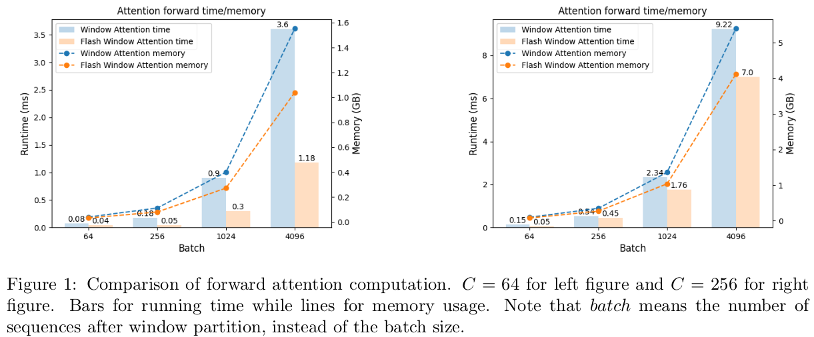
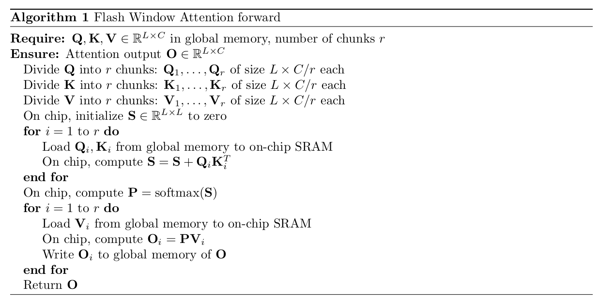

# Flash Window Attention: speedup the attention computation of Swin Transformer



### Introduction
Swin Transformer partitions an image into non-overlapping windows. Then it computes the attention output winthin each window. 
We call it window attention. Following the idea of flash attention, i.e. avoiding the storage of the attention matrix in GPU global memory, we propose 
Flash Window Attention to speed up Swin Transformer. We verified that a direct combination of window attention and flash attention is ineffective. Flash attention is specifically optimized for long sequences by tiling along the sequence dimension, but window attention involves short sequences with numerous instances processed in parallel.

Instead, we optimized the flash scheme tailored for short sequences, building on the following two key observations:
- For short sequences, the entire attention matrix can be stored in on-chip SRAM, eliminating the
need for slower global memory access.
- Attention computation can be decomposed along feature dimension.

We implement Flash Window Attention using Triton and PyTorch. Specifically, we develop GPU kernels using Triton and integrate them into PyTorch as an autograd
function. Under typical settings, we achieve speedup on attention computation up to 300% and end-to-end running up to 30%.



### Usage
Install this package:
```bash
pip install -e .
```
Use flash window attention function:
```python
import torch
from flash_swin_attn import flash_swin_attn_func

# suppose window partition is already done
batch, head, window_size, head_dim = 64, 4, 8, 64
q = torch.randn(batch, head, window_size ** 2, head_dim).cuda()
k = torch.randn(batch, head, window_size ** 2, head_dim).cuda()
v = torch.randn(batch, head, window_size ** 2, head_dim).cuda()

# flash window attention
bias, scale_qk = None, 1.0
o = flash_swin_attn_func(q, k, v, bias, scale_qk)
```

Use the attention module in Swin Transformer:
```python
import torch
from flash_swin_attn import WindowAttention

batch, window, c = 32, 7, 64
x = torch.randn(batch, window ** 2, c).cuda()
layer = WindowAttention(dim=c, window_size=(window, window), num_heads=4, is_flash=True).cuda()
y = layer(x)
```
Set `is_flash=False` to use the window attention.

### Notice
- Please make sure `dim//num_heads` is divisible by 16.
- The window size should be small, otherwise `out of on chip memory` error may occur.
- When tested on RTX 4090, window size can be up to `11x11`. The default window size in Swin Transformer is `7x7`.
- Dropout on attention matrix is not supported yet.

For more details, please refer to our technical report:
```
Flash Window Attention: speedup the attention computation for Swin Transformer 	
```